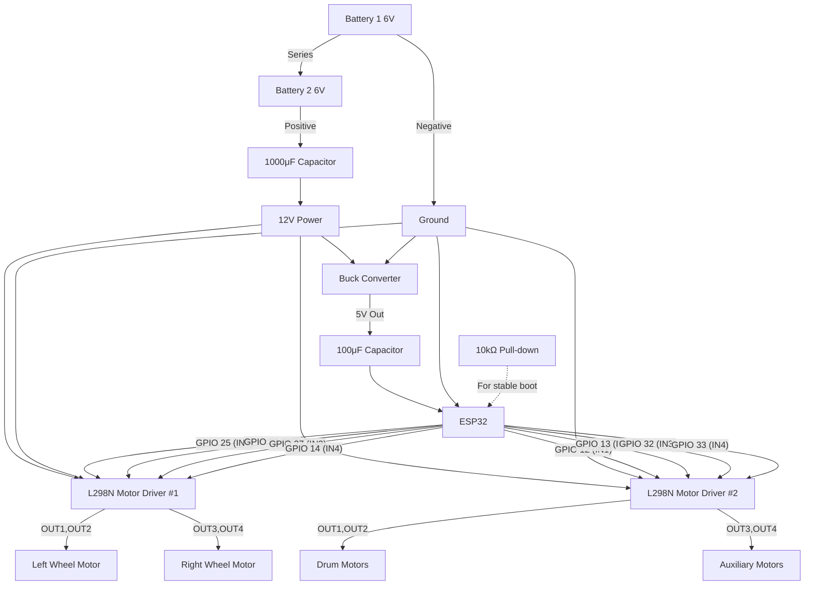
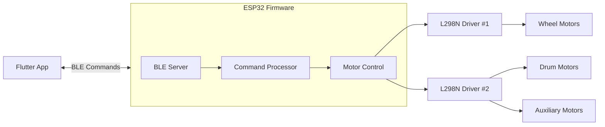

# ESP32 RoboWar Controller

A Bluetooth-controlled robot car project using ESP32 and Flutter. This system provides wireless control of multiple motors for a combat robot, including drive motors, drum weapons, and auxiliary systems.

## Table of Contents

- [System Overview](#system-overview)
- [Hardware Requirements](#hardware-requirements)
- [Connection Diagram](#connection-diagram)
- [Software Architecture](#software-architecture)
- [Setup Instructions](#setup-instructions)
- [Usage Guide](#usage-guide)
- [Troubleshooting](#troubleshooting)

## System Overview

This project implements a complete control system for a combat robot using:

- ESP32 microcontroller for motor control and Bluetooth communication
- Two L298N motor drivers to control multiple motors
- Flutter mobile app for wireless control
- Filtered power system with voltage regulation
- Bidirectional BLE communication for commands and status updates

## Hardware Requirements

- 1× ESP32 WROOM development board
- 2× L298N motor driver modules
- 2× 6V 5Ah SLA batteries (connected in series for 12V)
- 1× Buck converter (12V to 5V)
- 1× 1000μF capacitor (main power filtering)
- 1× 100μF capacitor (ESP32 power filtering)
- 2× Wheel motors
- 2× Drum motors
- 2× Auxiliary motors
- Connecting wires
- Optional: 10kΩ pull-down resistor for GPIO12

## Connection Diagram

## Detailed Hardware Connections

### Battery and Power System Connections

1. **Battery Pack**:
   - Connect two 6V 5Ah SLA batteries in series (positive terminal of first battery to negative terminal of second battery)
   - This gives you 12V output from the combined battery pack
   - Main positive lead comes from positive terminal of second battery
   - Main negative lead comes from negative terminal of first battery

2. **1000μF Capacitor** (main power filtering):
   - Connect positive terminal (longer lead/marked with +) to the main 12V positive lead
   - Connect negative terminal (shorter lead/unmarked) to the main ground lead
   - This helps filter voltage spikes from the motors

3. **Power Distribution**:
   - From the positive terminal of the 1000μF capacitor, connect wires to:
     - L298N Motor Driver #1 power input
     - L298N Motor Driver #2 power input
     - Buck converter input + terminal
   - From the negative terminal of the 1000μF capacitor, connect ground wires to:
     - L298N Motor Driver #1 ground
     - L298N Motor Driver #2 ground
     - Buck converter input - terminal

### Buck Converter & ESP32 Power

1. **Buck Converter**:
   - Input: Connected to main 12V power as described above
   - Output: Set to produce 5V stable output
   - Connect a heatsink to the buck converter if possible

2. **100μF Capacitor** (ESP32 power filtering):
   - Connect positive terminal (longer lead/marked with +) to buck converter output +
   - Connect negative terminal (shorter lead/unmarked) to buck converter output -
   - This provides clean, filtered 5V power for the ESP32

3. **ESP32 Power Connection**:
   - Connect positive terminal of 100μF capacitor to ESP32 VIN or 5V pin
   - Connect negative terminal of 100μF capacitor to ESP32 GND pin

### Motor Drivers to ESP32 Control Connections

1. **L298N Motor Driver #1** (for wheel motors):
   - Keep all jumpers on ENA/ENB pins for full speed operation
   - Connect IN1 to ESP32 GPIO 25 (Left Motor Forward)
   - Connect IN2 to ESP32 GPIO 26 (Left Motor Reverse)
   - Connect IN3 to ESP32 GPIO 27 (Right Motor Forward)
   - Connect IN4 to ESP32 GPIO 14 (Right Motor Reverse)

2. **L298N Motor Driver #2** (for drum and auxiliary motors):
   - Keep all jumpers on ENA/ENB pins for full speed operation
   - Connect IN1 to ESP32 GPIO 12 (Drum Motors Forward)
   - Connect IN2 to ESP32 GPIO 13 (Drum Motors Reverse)
   - Connect IN3 to ESP32 GPIO 32 (Auxiliary Motors Forward)
   - Connect IN4 to ESP32 GPIO 33 (Auxiliary Motors Reverse)

### Motor Driver to Motor Connections

1. **L298N Motor Driver #1 Outputs**:
   - Connect OUT1 and OUT2 to the Left Wheel Motor
   - Connect OUT3 and OUT4 to the Right Wheel Motor

2. **L298N Motor Driver #2 Outputs**:
   - Connect OUT1 and OUT2 in parallel to both Auxiliary Drum Motor 1 and Auxiliary Drum Motor 2
   - Connect OUT3 and OUT4 in parallel to both Auxiliary Motor 1 and Auxiliary Motor 2

## Software Architecture

### ESP32 Firmware (Arduino)

The ESP32 firmware handles:
- BLE server setup with Nordic UART Service
- GPIO pin initialization and motor control
- Command processing for all robot movements
- Status feedback via BLE notifications

### Flutter Mobile App

The Flutter app provides:
- Bluetooth device scanning and connection
- Intuitive control interface for all robot functions
- Status feedback from the robot
- Connection management

## Setup Instructions

### ESP32 Setup

1. Install Arduino IDE and ESP32 board support
2. Open robowar.ino in Arduino IDE
3. Connect ESP32 to computer via USB
4. Select the correct board and port
5. Upload the code to the ESP32

### Flutter App Setup

1. Install Flutter SDK and dependencies
2. Open the project in VS Code or Android Studio
3. Connect your Android device (iOS requires additional setup)
4. Run `flutter pub get` to install dependencies
5. Build and install the app with `flutter run`

## Usage Guide

### Controlling the Robot

The Flutter app provides the following controls:

- **Movement Controls**: Forward, Backward, Left, Right, Forward-Left, Forward-Right, Backward-Left, Backward-Right, Stop
- **Drum Controls**: Forward, Backward, Stop
- **Auxiliary Controls**: Forward, Backward, Stop

Each control sends a specific command to the ESP32:

| Function | Command | Description |
|----------|---------|-------------|
| Forward | F | Move robot forward |
| Backward | B | Move robot backward |
| Left | L | Turn robot left |
| Right | R | Turn robot right |
| Forward-Left | FL | Move forward while turning left |
| Forward-Right | FR | Move forward while turning right |
| Backward-Left | BL | Move backward while turning left |
| Backward-Right | BR | Move backward while turning right |
| Stop Movement | S | Stop all wheel motors |
| Drum Forward | DF | Spin drum forward |
| Drum Backward | DB | Spin drum backward |
| Drum Stop | DS | Stop drum motors |
| Auxiliary Forward | AF | Run auxiliary motors forward |
| Auxiliary Backward | AB | Run auxiliary motors backward |
| Auxiliary Stop | AS | Stop auxiliary motors |

## Troubleshooting

### ESP32 Boot Issues

If the ESP32 immediately activates motors when powered on:
1. Add a 10kΩ pull-down resistor between GPIO12 and GND
2. Erase the ESP32 flash completely before uploading code
3. Consider changing the drum motor pin from GPIO12 to GPIO15

### Bluetooth Connection Issues

If the ESP32 doesn't appear in the Bluetooth scan:
1. Ensure the ESP32 is properly powered
2. Check if the serial monitor shows "BLE ready" message
3. Restart your phone's Bluetooth

### Motor Control Issues

If motors don't respond correctly:
1. Check all wire connections to the L298N drivers
2. Verify the battery voltage is sufficient (>11V)
3. Ensure motor driver jumpers are installed for full power

## Technical Details

### BLE Communication

The project uses the Nordic UART Service (NUS) for BLE communication:
- Service UUID: `6E400001-B5A3-F393-E0A9-E50E24DCCA9E`
- TX Characteristic (App → ESP32): `6E400002-B5A3-F393-E0A9-E50E24DCCA9E`
- RX Characteristic (ESP32 → App): `6E400003-B5A3-F393-E0A9-E50E24DCCA9E`

This provides a bidirectional communication channel that mimics a serial connection over Bluetooth Low Energy.
